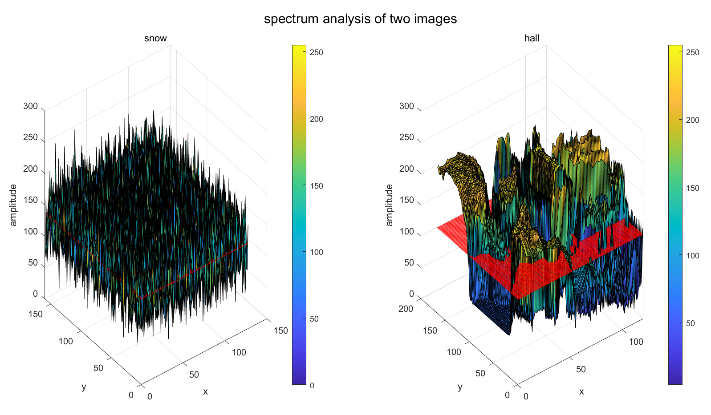

# **Basic Commands**

在多张子图上面加一个总标题

$\text{sgtitle(sprintf("...\%d,\%3.2f,...",x,y))}$


clc:clear command

save file_name

load file_name

whos -file file_name


help 调出help-center

dir 查看路径下所有文件

s=dir();


**矩阵：, 分隔列，        ；分隔行**

**拼接： A=[1.2;3.4]** 

​			**B=[5,6,]**

**[A;B]**


**Help signal l**

fdatool - Filter Design and Analysis Tool. 

fvtool - Filter Visualization Tool.

sptool - Signal Processing Tool.

Wintool - Window Design and Analysis Tool

wvtool - Window Visualization Tool.


# **Date Structures**

linspace and vector:

```matlab
t=linspace(start,end,num=100);
```

create  a row vector that contains 'num' points within closed interval [start,end]

default of num is 100.


```matlab
t=[start:interval:end];
```

create a row vector [start,end] that has an interval length of "interval"


How to check datatypes:

```
>> h=3;
>> isa(h,'double')

ans =

  logical

   1
```

```matlab
isa(h,'function_handle').
```


Distinguish vector arrays and cells


**Vector: define with [] read/write with ()**

**Cells:    define with {} read/write with {}**

```
a=[1,2];
>> a

a =

     1     2

>> a(3)=3;
>> a

a =

     1     2     3
```


```
>> a={1,2};
>> a{3}=3;
>> a

a =

  1×3 cell 数组

    {[1]}    {[2]}    {[3]}
```


**Inner product of vectors:**  

**<u>remember to add transpose</u>**


```matlab
zeros(16,2,8);
 	 0     0
     0     0
     0     0
     0     0
     0     0
     0     0
     0     0
     0     0
     0     0
     0     0
     0     0
     0     0
     0     0
     0     0
     0     0
     0     0
```


>> A  2×2 cell 数组

    {["string"]}    {[       1]}
    {[     1 2]}    {2×4 double}

>> A{2,2}

     1     3     5     7
     2     8     3     9

>> A(2,2)   1×1 cell 数组

    {2×4 double}

<u>**note that A{i,j} returns a value**</u>

<u>**but A(i,j) returns an object(a reference)**</u>

**You cannot write to a A(i,j);**

**You can only  write to an A{i,j};**

**But you can read data out from A(i,j) and A{i.j};**


To add new items to an array:

Write to a  non-existing item of A. like A{23}=... then you are adding an item to A.


# **Console Display Control**

行末有“;”则不回显结果，否则回显 

echo on和off控制的是命令行的显示，而非命令结果的 回显 

**一个命令写在多行时用“…”表示续行** 

**多个命令写在一行时，可以用“;”或“ , ”分开**


# Find official tutorial

**doc pwd**
**help pwd**


# **Defining and calling functions**


## **<u>Remember that functions must be defined in another file, with the filename being exactly the function name.</u>**


### **Define functions with return values**

**Input values: tuple ()**

**return values: vector []**

```matlab
[y1,y2,...ym]=function_name(x1,x2,...xn)
```


remember to declare the function mapping format(number of returns, formats) right at the place of function declaration.

**There is NO "return" sentence in MATLAB**, you declare the variable to return in advance and simply calculate its value in the body. Then wait and do nothing for an autonomous return to get the computed value. 

**One input, one output:** 

```matlab
function x_plus=untitled5(x)

disp("hi");
x_plus=x+1

end
```


**Multiple input,multiple outputs**


Function handles (like the function pointers in C)

```matlab
%plot sin, sqrt, exp and a customized function x^2-4*x+1 in the same plot.

%the horizon.
t = [0:0.1:2*pi]';
%create an array of function handle, which only contains two function
%handles. 

%@sin: create a functinon handle with standard definition.(and a name)
fh = {@sin};

%now we add new function handles one by one.

%@customized_function_name: create a pointer to a user-defined function
%that is defined in another file. remember to add '@'
fh{2}=@compute_sqrt;

%str2func(.):  create a special function that is recorded by MATLAB and has
%a unique name.
fh{3} = str2func('exp');

%customize a function without a name.
%format:     @(para list) function_mapping_structure
fh{4} = @(t)t.^2-4*t+1;

figure;
for n = 1:4
    subplot(2,2,n);
    plot(t,fh{n}(t));
    xlabel('t');
    %convert the function handles back to strings(function names)
    title([func2str(fh{n}),'(t)']);
    %control the horizontal width of our graph. gca: graphical current axes
    set(gca,'XLim',[0,2*pi]);
end
```


# Mathematical Solving


## **Partial fraction expansion**

Find the partial fraction expansion of the following ratio of polynomials *F*(*s*) using `residue`

*F*(*s*)=*b*(*s*)*a*(*s*)=−4*s*+8*s*2+6*s*+8.

```
b = [-4 8];
a = [1 6 8];
[r,p,k] = residue(b,a)
r = 2×1

   -12
     8
p = 2×1

    -4
    -2
k =

     []
```

This represents the partial fraction expansion


−4*s*+8*s*2+6*s*+8=−12*s*+4+8*s*+2.


Convert the partial fraction expansion back to polynomial coefficients using `residue`.

```
[b,a] = residue(r,p,k)
b = 1×2

    -4     8
a = 1×3

     1     6     8
```

This result represents the original fraction *F*(*s*).


## **Difference Equations**


Due to normalization, we define a general standard form of difference equation as follows:

$y[n]+a_2y[n-1]+...+a_N u[n-(N-1)]=b_1x[n]+...+b_Mx[n-(M-1)]$

Transfer function:

$\H(s):=\frac{<\vec{b},\vec{s_x}>}{<\vec{a},\vec{s_y}}$

Here vectors $\vec{b}:=[b_1,...b_M]^T$, $\vec{a}:=[a_1,...a_N]^T$ are the coefficients

This function corresponds to an IIR implementation

<u>**If there are N terms that retrieves temporal information in the NEGATIVE time domain,  then this equation is of order N, and**</u> 

<u>**we need N initial conditions for this variable.**</u>


In MATLAB, we define the "initial conditions" of this equation, not as the $y[n-m]$s, but as $\vec{z}:=[z_1,...z_m]$ 


**In standard MATLAB language:**

```matlab
%coefficients
b=[1, -1];
a=[1,-1,0.24];

% input signal(excitement)
n=[0:20]';
u=(n>=0);
x=n.^2;

%calculate initial conditions(abbr.ic)
%initial conditions for the system is derived from ics for the 
%IO signals.
%initial conditions of the signals are packed like [y(n-1),y(n-2),...y(n-k)]_{n=0} and [x(n-1),x(n-2),...x(n-m)]|_{n=0}
%where this equation is of order k w.r.t. y and order m w.r.t. x.
%in the special case, y is of second order, so we need 2 ics.
y_ic=[-1,-2];
% x is of 1 order, one ic.
x_ic=0 
%create initial condition vector.
ic = filtic(b,a,y_ic,x_ic);

%compute full response and final condition by input x and initial condition of the system(ic vector.)
[y,fc]=filter(b,a,x,ic);

%plot a discrete-time plot.
stem(y);
```

```matlab
%fc: final condition  ic:initial condition (both about z-s)
%x_coeff,y_coeff: see the equation.
%x:input signal
%y:output signal
ic= filtic(b,a,y_ic,x_ic);%if we neglect the last argument, it returns zero input inital condition.
[y,fc]=filter(x_coeff,y_coeff,x,ic);
```

**Parallel computing of multiple difference equations**

Suppose that there are multiple differential equations with inputs $\{x_k\}_k$ and initial conditions $\{ic_k\}_k$ that shares the same function structure $\vec{b}$ and $\vec{a}$ 


then we can **call the filter function** by packing multiple initial conditions $\color{red}{in \space columns}$ to **solve multiple IVPs for a same equation with different initial conditions together: **

```matlab
[y,f_c]=filter(b,a,[x_1,x_2,...x_k]^T,[ic_1,ic_2,...ic_k]^T)
```

This makes the return value **y become a matrix**. **when indexed by column**, it returns the output for each of the equation with specified initial conditions.

**e.g. y(:,3) gives the solution to the equation with initial value ic_3**

**Remember to get the $\textcolor{red}{transpose}$ of each of the initial conditions then pack them together.**


# **Plot**

## **Make Images Pretty**


 **control the horizontal width of our graph. gca: graphical current axe**s

```matlab
set(gca,'XLim',[0,2*pi]);
```


**Box**: the surrounding rectangular rim of a  2D/3D plot.

Also an object, that your can specify its attributes.

```matlab
ax = gca; %get the "grafical current axes" as ax.
ax.BoxStyle = 'full'; %set the box style.
ax.XColor = 'red';
```


'


## **2D plot**


## **3D plot**


 


```matlab
%freq_analysis.mlx
%analyze the frequency spectrum of two images.
load hall.mat;
load snow.mat;
dct_snow=dct2(snow);
dct_hall=dct2(hall_gray);

subplot(1,2,1);
plot_3D(snow);
title("snow");
subplot(1,2,2);
plot_3D(hall_gray);
title("hall");
sgtitle("spectrum analysis of two images");


function plot_3D(dat)
sz=size(dat);
mean_amp=mean(dat,"all");
[x,y]=meshgrid(1:1:sz(1),1:1:sz(2));

mean_surf=ones(sz).*mean_amp;
surf(x',y',dat); 
hold on
plot3(x',y',mean_surf,'Color','red');
colorbar;
hold off

xlabel("x");
ylabel("y");
zlabel("amplitude");
colorbar;
end
```


Category---MATLAB--中间栏Functions


**性能分析**

写一个脚本

```
profile on


profile viewer
```

数值方法傅里叶变换j近似

用直方图面积近似积分

$F(\omega)=\underset{-\infty}{\overset{+\infty}\int} f(t)e^{-i\omega t}dt$


fourier trans


>> syms x
>> fourier(dirac(x))

ans =

1

>> ifourier(dirac(x))

ans =

1/(2*pi)


**卷积的这个例题不能直接用conv，而必须用你手写的conv1**

因为要调节支集的位置


**dirac函数在仿真是的是模拟值实际上是取样间隔的倒数，来自定义：全空间积分为1**


**一般的非线性时变系统仿真：暴解微分方程**

**这里ode23是一个系统函数**


**最简单的线性时不变系统仿真**

**sys=ss(a,b,c,d,)  给定4个矩阵，返回以之为特征矩阵的状态空间state space(ss)**

**lsim: LTIsimulation**


rand(3,1)

生成3个[0,1]中的uniform distribution

randn(3)

生成3个高斯随机变量值


**plot 本质上是按照向量的点对的顺序进行连线**

stem是离散版的plot

ezplot() easy plot


查找某个函数的docs快速执行：

```matlab
doc func_name
```

卷积就是多项式乘法


有一个属性是；ButtonDownFct如果点击了线条则会产生什么反应，可以自己写一个函数，然后更改此plot的ButtonDownFct属性来自定义如果点击到此线性会有什么反应


这里定义了点击线性时的反应函数 为myfunct，其功能是直接print一个字符串。

然后我真的直接在生成的图里点击线性就会再对话框中出现hello world 的字符


向量逐个元素进行操作.^2 要对对应的数值操作加一个“.“


**句柄图形**

**figure**		%生成一个空画布

>> h=plot(randn(5,1));%in default, the horizontal vector is 1,2,3,...
>
>> h

h = 

  Line - 属性:

              Color: [0 0.4470 0.7410]
          LineStyle: '-'
          LineWidth: 0.5000
             Marker: 'none'
         MarkerSize: 6
    MarkerFaceColor: 'none'
              XData: [1 2 3 4 5]
              YData: [0.5377 1.8339 -2.2588 … ]
              ZData: [1×0 double]

  显示 所有属性

>> set(h,'Color',[1 0 0]);
>> set(h,'Color',[1 0 0])%color is a (r,g,b) triplet. this command changes the color of the lines to red.
>> g=plot(randn(5,1),'--xb', 'LineWidth',5)

g = 

  Line - 属性:

              Color: [0 0 1]
          LineStyle: '--'
          LineWidth: 5
             Marker: 'x'
         MarkerSize: 6
    MarkerFaceColor: 'none'
              XData: [1 2 3 4 5]
              YData: [-1.3077 -0.4336 0.3426 … ]
              ZData: [1×0 double]

  显示 所有属性

无法显示变量 h 的属性，因为它引用了已删除的对象。
>> h

h = 

  已删除的 Line 的句柄

>> g

g = 

  Line - 属性:

              Color: [0 0 1]
          LineStyle: '--'
          LineWidth: 5
             Marker: 'x'
         MarkerSize: 6
    MarkerFaceColor: 'none'
              XData: [1 2 3 4 5]
              YData: [-1.3077 -0.4336 0.3426 … ]
              ZData: [1×0 double]

  显示 所有属性


所有图都是一个对象， 可以通过写他的名字来查看其所有属性。用set指令可以实时改变其属性值


**注意：matlab里面i默认为虚数单位不要作循环变量**


**新建实时脚本**  

**添加滑动槽** 


**导出----LateX  PDF**

##### 


**改变对话框的大小： ctrl+scroll (your mouse)**

改变边栏的字符大小：


构造噪声

y=x+randn(size(x));

plot(t,y);


左除:    

$A\vec{x}=\vec{b}$


$\vec{x}=  \ \vec{b}$x

x=A\b


randn  random normal

eig(.) find eigenvalue

imagesc(.)

surf(.)

colorbar

hist(X(:))

plot(eig(X))


**doc** exprdisp

gradien()

quiver([1:40\] \ [1:49],u,v)


contour

调出helpcenter:


步长默认为1


    >> x=randn(3)

x =

    0.5377    0.8622   -0.4336
    1.8339    0.3188    0.3426
   -2.2588   -1.3077    3.5784

>> 1:0.5:5

ans =

    1.0000    1.5000    2.0000    2.5000    3.0000    3.5000    4.0000    4.5000    5.0000

>> 5:-1:1

ans =

     5     4     3     2     1

>> 1:5

ans =

     1     2     3     4     5

>> 5:1

ans =

  空的 1×0 double 行向量

>> t=[0:0.1:2*pi]

t =

  列 1 至 11

         0    0.1000    0.2000    0.3000    0.4000    0.5000    0.6000    0.7000    0.8000    0.9000    1.0000

  列 12 至 22

    1.1000    1.2000    1.3000    1.4000    1.5000    1.6000    1.7000    1.8000    1.9000    2.0000    2.1000

  列 23 至 33

    2.2000    2.3000    2.4000    2.5000    2.6000    2.7000    2.8000    2.9000    3.0000    3.1000    3.2000

  列 34 至 44

    3.3000    3.4000    3.5000    3.6000    3.7000    3.8000    3.9000    4.0000    4.1000    4.2000    4.3000

  列 45 至 55

    4.4000    4.5000    4.6000    4.7000    4.8000    4.9000    5.0000    5.1000    5.2000    5.3000    5.4000

  列 56 至 63

    5.5000    5.6000    5.7000    5.8000    5.9000    6.0000    6.1000    6.2000

>> plot(t,sin(t))
>> grid on
>> A=magic(5)

A =

    17    24     1     8    15
    23     5     7    14    16
     4     6    13    20    22
    10    12    19    21     3
    11    18    25     2     9

>> A(1,2)

ans =

    24

>> A(1,1:3)

ans =

    17    24     1

>> A(3:5,5)

ans =

    22
     3
     9

>> A(3:5,end)

ans =

    22
     3
     9

>> A(3:5,end-1:end)

ans =

    20    22
    21     3
     2     9

>

>> A=eye(5)

A =

     1     0     0     0     0
     0     1     0     0     0
     0     0     1     0     0
     0     0     0     1     0
     0     0     0     0     1

>> A+[1:5]

ans =

     2     2     3     4     5
     1     3     3     4     5
     1     2     4     4     5
     1     2     3     5     5
     1     2     3     4     6

>> A+[1:5]

ans =

     2     2     3     4     5
     1     3     3     4     5
     1     2     4     4     5
     1     2     3     5     5
     1     2     3     4     6

>
>> A+[1:5]'

ans =

     2     1     1     1     1
     2     3     2     2     2
     3     3     4     3     3
     4     4     4     5     4
     5     5     5     5     6

>

>> A=[10:10:50]

A =

    10    20    30    40    50

>> A>30

ans =

  1×5 logical 数组

   0   0   0   1   1

>> A>30&A<50

ans =

  1×5 logical 数组

   0   0   0   1   0

>> A(A>30&A<50)

ans =

    40

>> any(10)

ans =

  logical

   1

>> all(10)

ans =

  logical

   1


**.'   转置**

**'    共轭转置**


**对矩阵求逐元素和**

sum([1:100]) 


6,0,5,0.60,
7,0,5,0.45,
1,0,6,0.45,
5,1,5,0.45,
6,0,5,0.45,
4,0,5,0.45,
3,0,5,1,
3,0,5,1,
3,0,5,1,
3,0,5,1,
4,0,5,0.5,
3,0,5,0.5,
2,0,5,0.5,
7,0,4,0.5,
1,0,5,1,
6,0,4,2,
6,0,5,0.60,
7,0,5,0.45,
1,0,6,0.45,
5,1,5,0.45,
6,0,5,0.45,
4,0,5,0.45,
3,0,5,1,
3,0,5,1,
3,0,5,1,
3,0,5,1,
4,0,5,0.5,
3,0,5,0.5,
2,0,5,0.5,
7,0,4,0.5,
1,0,5,1,
6,0,4,2,

6,0,5,1,

6,0,5,1,

6,0,5,1,

5,0,5,3,
1,0,5,1,
6,0,4,0.5,
7,0,4,0.5,
1,0,5,0.5,
4,0,5,0.5,
3,0,5,3,