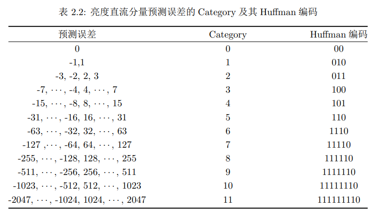
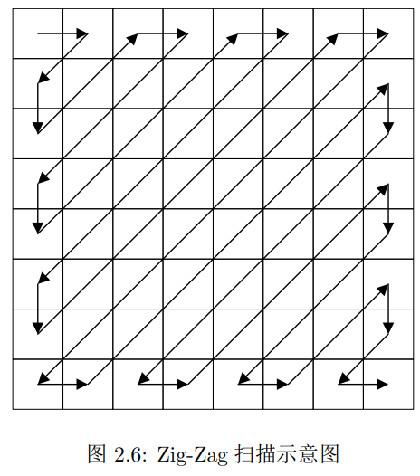
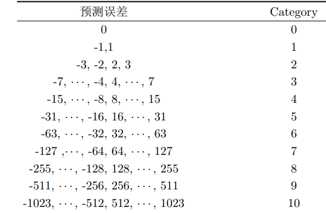
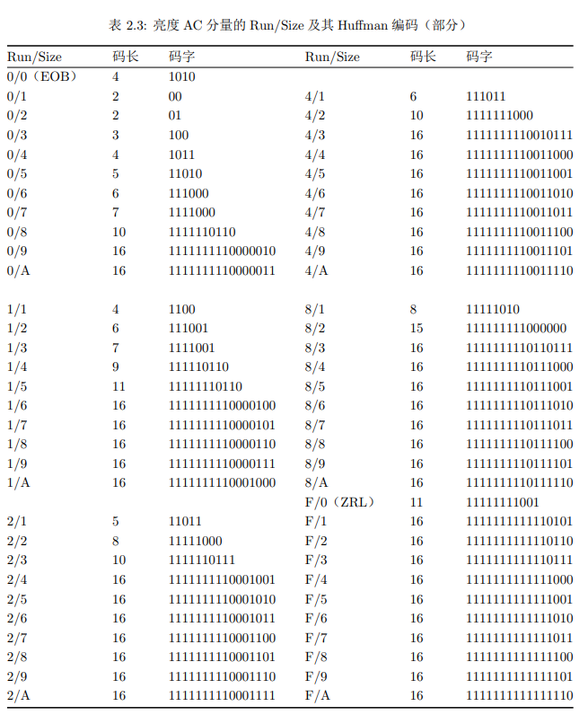
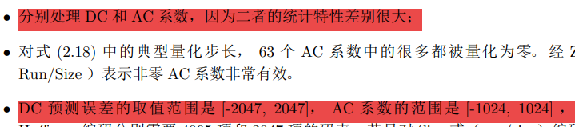

**DCT变换矩阵**

$\mathbf{D}=\sqrt{\frac{2}{N}}\left[\begin{array}{cccc}\sqrt{\frac{1}{2}}&\sqrt{\frac{1}{2}}&\cdots&\sqrt{\frac{1}{2}}\\\cos\frac{\pi}{2N}&\cos\frac{3\pi}{2N}&\cdots&\cos\frac{(2N-1)\pi}{2N}\\\vdots&\vdots&\ddots&\vdots\\\cos\frac{(N-1)\pi}{2N}&\cos\frac{(N-1)3\pi}{2N}&\cdots&\cos\frac{(N-1)(2N-1)\pi}{2N}\end{array}\right] & D^{-1}=D^{T}$

**D is unitary matrix. DCT is an orthogonal transform**

**1D DCT ** $\R^N \rightarrow \R^N$

$\vec{c}=D\vec{p}$

$\vec{p}=D^{-1}\vec{c}=D^T\vec{c}$

$p_x=\sum_{x=0}^{N-1}c_j cos(\frac{j\pi}{2N}x)\quad \forall x =0,1,\cdots N-1$

$c_{i}=\alpha_{i}\sum_{x=0}^{N-1}p_{x}\cos\frac{i(2x+1)\pi}{2N},\quad\forall i=0,1,\cdots,N-1$

**2D DCT**  $\mathbb{M}_{N\times N}(\R)\rightarrow\mathbb{M}_{N\times N}(\R)$

$\begin{aligned}\mathbf{C} & =\mathbf{DPD}^{\mathrm{T}} & \mathbf{P} & =\mathbf{D}^{\mathrm{T}}\mathbf{CD}\\  &  &  &  & \\ \mathbf{C} & =\sum_{x=0}^{N-1}\sum_{y=0}^{N-1}P_{x,y}\mathbf{D}^{(2)}(x,y) &   \mathbf{P} & =\sum_{i=0}^{N-1}\sum_{j=0}^{N-1}C_{i,j}\mathbf{D}^{(2)}(i,j)\end{aligned}$ 

$C_{i,j}=\alpha_{i}\alpha_{j}\sum_{x=0}^{N-1}\sum_{y=0}^{N-1}P_{x,y}\cos\frac{i(2x+1)\pi}{2N}\cos\frac{j(2y+1)\pi}{2N}\quad\forall i,j=0,1,\cdots,N-1$ 

**$\begin{aligned} \forall x,y=0,1,\cdots,N-1 :\mathbf{D}_{x,y}^{(2)}\in \mathbb{M}_{N\times N}(\R):&\\ & & \mathbf{D}_{x,y}^{(2)}(i,j)=\alpha_i\alpha_j\cos\frac{i(2x+1)\pi}{2N}\cos\frac{j(2y+1)\pi}{2N}\quad\end{aligned}$**

**in JPEG(joint photography expert group)**

**N=8**

**量化值**

**我们对拿到的图像的每个8x8块进行批处理，对每个8x8块内部的像素赋予相对强弱以在适应人眼的同时完成数据压缩**

**$i,j$ 是正弦基底编号： $i,j \in [8]^2$**

**也是图像的一个8x8块中每个像素的空间坐标**

$\forall i,j\in[N]:&\\\tilde{C}_{i,j}:=& \text{round}(\frac{C_{i.j}}{Q_{i,j}})\in \Z_{\geq 0}$

## **熵编码**

### **DC 编码**

#### **汇集所有像素块的直流分量为一个向量(DC系数)**

$\tilde{\mathbf{c}}_{D}=\left[\tilde{C}_{0,0}(1,1),\tilde{C}_{0,0}(1,2),\cdots,\tilde{C}_{0,0}(1,W),\tilde{C}_{0,0}(2,1),\tilde{C}_{0,0}(2,2),\cdots,\tilde{C}_{0,0}(H,W)\right]$ 

#### **直流分量差分编码后的预测误差**

$\hat c_D(n)=\left\{\begin{array}{ll}\tilde c_D(n)&n=1;\\\tilde c_D(n-1)-\tilde c_D(n)&\text{else}\end{array}\right.$  

其中$\tilde{c}_D(n)$ 代指向量$\tilde{c}_D$ 中的第n个元素

#### **预测误差的熵编码**     

对$\hat{C}_D$ 的每个元素执行如下操作，之后再无缝衔接地拼回长为二进制矢量（长度会明显高于$H\times W$, 因为共有$H \times W$ 个整数被编码成了二进制）

$x \rightarrow \text{Huffman(x);$(x)_{1’s}$}$

where  Huffman(x) is derived from the lookup table below (DCTAB in the project)

​			

​			$(x)_{1’s}$ is the 1’s complement of x

​			 $x_{1's}=\sim (x_2):\text{convert to binary, then invert each bit}$

### AC 编码

**zig-zag scanning and run-length-coding**

按照右图**zigzag 扫描顺序**对扫到的每个**非零**元素进行如下操作：

​	Amplitude<=此元素的1补码

​    Run<=此元素之前的0元素个数  <u>**注意如果Run>16则记为16 (Run=2’hF=ZRL)**</u>

​	 根据此图

​    确定该元素的Size（=Category）

​	 将(Run, Size)二元组按照下标查表得到Huffman 编码

​	 

将  Huffman;Amplitude拼接起来作为此元素的编码

进行zigzag之后将所有的编码顺序链接起来成为一个非常长的二进制码

最后插入结束符EOB=**1010**

Space domain shift: $P \rightarrow \tilde{P}:=P-128 \cdot \mathbb1_{N\times N}$

where $\mathbb 1$ means matrix of ones.

By the definition of DCT, 

$\tilde{C}=D\tilde{P}D^T=D(P-128 \mathbb{1})D^T=DPD^T-128D\mathbb{1}D^T=C-128D\mathbb{1}D^T$  

So we can see that 

Frequency Domain shift: $C\rightarrow \tilde{C}:=C-128D\mathbb1D^T$ 

Now we try to give a closed form of the frequency shift amount

$(D\mathbb1D^T)_{i,j}=\sum_{k\in[N]}({D\mathbb1})_{i,.k}\cdot D^T_{k,j}=\sum_{k \in [N] }\sum_{l \in [N]}D_{i,l}\mathbb1_{l,k}D_{j,k}=\sum_{k,l\in [N]^2}D_{i,l}\cdot D_{j,k}=\sum_{l \in [N]}D_{i,l}\sum_{k \in [N]}D_{j,k}$ 

Before that, we need the following lemma:

$\textbf{Lemma}:$  

$\forall w\ne 0,\forall \phi_0 \in \R:\sum_{k=1}^{N}cos(kw+\phi_0) =\frac{sin(Nw/2)}{sin(w/2)}cos(\frac{N+1}{2}w+\phi_0)  $ 

$\text{Proof}:$

With the help of following identities, 

$sinAcosB=(sin(B+A)-sin(B-A))/2$

$\begin{aligned}sinA-sinB&=sin(\frac{A+B}{2}+\frac{A-B}{2})-sin(\frac{A+B}{2}-\frac{A-B}{2}) \\&=2\cdot sin(\frac{A-B}{2})cos(\frac{A+B}{2})\end{aligned}$

We conclude that

$\forall w\ne 0,\forall \phi_0 \in \R$

 $\begin{aligned} \sum_{k=1}^{N}cos(kw+\phi_0) & =\frac{1}{sin(w/2)} \sum_{k=1}^{N}sin(w/2)cos(kw+\phi_0)\\  & =\frac{1}{sin(w/2)}\sum_{k=1}^{N}\frac{sin[(k+1/2)w+\phi_0]-sin[(k-1/2)w+\phi_0]}{2}\\   & =\frac{1}{2sin(w/2)}[sin((N+1/2)w+\phi_0)-sin((1/2)w+\phi_0)]\\  & =\frac{1}{2sin(w/2)}2sin(Nw/2)cos(\frac{N+1}{2}w+\phi_0)\\  &=\frac{sin(Nw/2)}{sin(w/2)}cos(\frac{N+1}{2}w+\phi_0) &\square\end{aligned}$

$\textbf{Main result}$

By the definition of DCT operator, 

$\mathbf{D}=\sqrt{\frac{2}{N}}\left[\begin{array}{cccc}\sqrt{\frac{1}{2}}&\sqrt{\frac{1}{2}}&\cdots&\sqrt{\frac{1}{2}}\\\cos\frac{\pi}{2N}&\cos\frac{3\pi}{2N}&\cdots&\cos\frac{(2N-1)\pi}{2N}\\\vdots&\vdots&\ddots&\vdots\\\cos\frac{(N-1)\pi}{2N}&\cos\frac{(N-1)3\pi}{2N}&\cdots&\cos\frac{(N-1)(2N-1)\pi}{2N}\end{array}\right] & D^{-1}=D^{T}$ 

$\begin{aligned} D_{i,j}&:=\sqrt{\frac{2}{N}} \begin{cases}  \sqrt{\frac{1}{2}} &,i=1\\cos(\frac{(i-1)\pi }{2N}\cdot (2j-1)) &,2\leq i\leq N \end{cases} \\&=\begin{cases}\sqrt{\frac{1}{N}}&,i=1 \\\sqrt{\frac{2}{N}}cos(\frac{(i-1)\pi}{N}j-\frac{i-1}{2N}\pi ) &,2 \leq i \leq N \end{cases}\end{aligned}$ 

with the help of the previous lemma, it is not hard to see that

$ \begin{aligned}{\sum}_ {j=1}^ND_{i,j}&=\sqrt{\frac{2}{N}}\cdot   \begin{cases}&\sqrt{\frac{N^2}{2}} &,i=1\\  & \frac{sin(N/2\cdot \frac{i-1}{N}\pi)}{sin(\frac{i-1}{N}\pi/2)}cos(\frac{N+1}{2} \frac{i-1}{N}\pi-\frac{i-1}{2N}\pi)&,2\leq i\leq N \end{cases}\\ &= \begin{cases} \sqrt{N} &, i=1 \\ \sqrt{\frac{2}{N}} \frac{sin(\frac{i-1}{2}\pi)}{sin(\frac{i-1}{2N}\pi)}cos(\frac{i-1}{2}\pi) &,2\leq i \leq N\end{cases}\end{aligned}$  

**In the sense of continuous extension**($\sum_{j=1}^ND_{0,j}:=\underset{i \rightarrow0}{\lim} \sum_{j=1}^N D_{i,j}$)

we can make our expression more compact：

$\mathbf{\sum_{j=1}^N D_{i,j}=\sqrt{\frac{2}{N}} \frac{sin(\frac{i-1}{2}\pi)}{sin(\frac{i-1}{2N}\pi)}cos(\frac{i-1}{2}\pi),\forall i \in [N]}$ 

**So the shift amount in  frequency domain that corresponds to space-domain -128 operation can be expressed as**

$(D\mathbb1D^T)_{i,j} =\begin{cases}N &,i=1,j=1 \\\frac{2}{N}\frac{sin(\frac{i-1}{2}\pi)}{sin(\frac{i-1}{2N}\pi)}cos(\frac{i-1}{2}\pi) \cdot \frac{sin(\frac{j-1}{2}\pi)}{sin(\frac{j-1}{2N}\pi)}cos(\frac{j-1}{2}\pi) &,i \ne1,j\ne1 \\2 \frac{sin(\frac{j-1}{2}\pi)}{sin(\frac{j-1}{2N}\pi)}cos(\frac{j-1}{2}\pi) &,i=1,j\ne1\\2\frac{sin(\frac{i-1}{2}\pi)}{sin(\frac{i-1}{2N}\pi)}cos(\frac{i-1}{2}\pi) &,i\ne 1 ,j=1 \end{cases}$

**And the frequency shift is**  $C\rightarrow \tilde{C}:=C-128D\mathbb1D^T$  

 

真彩色表示系统

Total number of vectors  $M=2^{3 \times L}$ 

each color has a color number $n\in[M]=[2^{3\times L}]$ 

and is encoded  by a $3\times L$ bits row vector $\vec{c}$ 

$r=\vec{c}_{3L:2L+1}$

$g=\vec{c}_{2L:L+1}$

$b=\vec{c}_{L:1}$

relation between binary encoding and uint number:

$n=r<<2L+g<<L+b$

Region in an image $\mathbf{R}$

The frequency that color n appears in region $\mathbf{R}$

$f_{n}(\mathbf{R}):=\frac{1}{\text{\color{red}{\# $\mathbf{R}$ }}}\underset{(x,y)\in \mathbf{R}}{\sum} \mathbb{1}\{r_{x,y}<<2L+g_{x,y} <<L+b_{x,y}=n\}\in [0,1]^{3 \times L}$

where $\# \mathbf{R}$ is the size(number of pixels) of the area $\mathbf{R}$

The color feature of a region $\mathbf{R}$

$\vec{u}(\mathbf{R})=[f_0(\mathbf{R}),\cdots f_{N-1}(\mathbf{R})]^T$

Standard feature of humans’ faces

$R_i$ is the region in the i-th image in training data that a human’s face occurs.

there are $I$ regions in which a human’s face can be detected.(size of training set)

human featured learnt on this training set $\mathscr{T}$ is

$\vec{v} :=\frac{1}{I}\underset{i}{\sum} \vec{u}(R)\in [0,1]^{3 \times L}$ 

feature similarity metric

$d(\vec{u}(\mathbf{R},\vec{v}):=1-\text{sum}(\text{sqrt}(\vec{u}.*\vec{v}))$

Human face detection

to detect whether human faces occur in an image $\text{Face}$

$\text{if $\exist$  R $\in $ Face s.t. d($\vec{u}(R),\vec{v}$)$\lt \epsilon$}$

iteration

$\frac{S_n}{n} \rightarrow\frac{S_{n+1}}{n+1}$

$\delta_n=\frac{S_{n+1}}{n+1}-\frac{S_n}{n}=\frac{nS_n+na_{n+1}-nS_n-S_n}{n(n+1)}=\frac{n\cdot a_{n+1}-S_n}{n(n+1)}=\frac{a_{n+1}}{n+1}-\frac{S_n}{n(n+1)}$

$M_1:=a_1$

$M_{n+1}=M_{n}+\delta_{n+1}=(1-\frac{1}{n+1})M_n+\frac{1}{n+1}a_{n+1}=\frac{n}{n+1}M_n+\frac{1}{n+1}a_{n+1}=\frac{1}{n+1}(nM_n+a_{n+1})$

Iterative method recap:

to calculate $M_I=\frac{\sum_{i=1}^I a_i}{I}$ ,we can execute the following algorithm

$M_0:=0$

$M_n<=\frac{(n-1)M_{n-1}+a_n}{n}$  $\forall n\in[I]$

